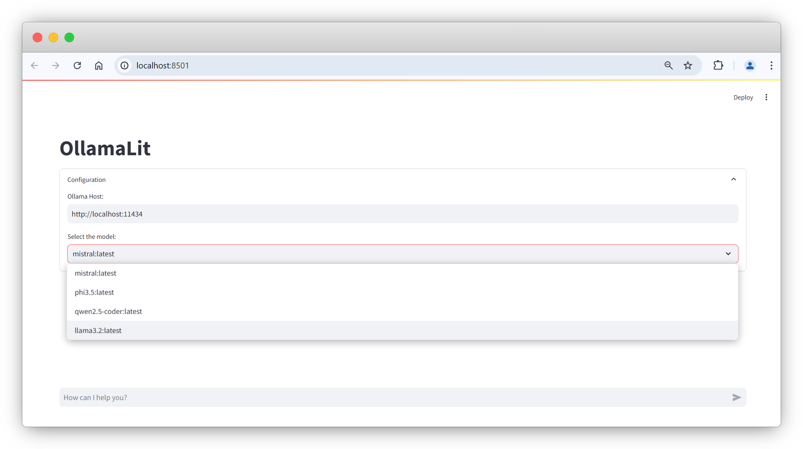

# OllamaLit (Ollama + Streamlit)

**OllamaLit** is a Streamlit-based user interface for interacting with the [Ollama](https://ollama.com). This project provides a simple yet powerful chat interface for querying models hosted on an Ollama server.

## Features

- **User-Friendly Chat Interface**: Engage in real-time conversations with the Ollama models directly through a Streamlit-based UI.
- **Dynamic Model Selection**: Select from multiple models hosted on your Ollama server.
- **Live Streaming Responses**: Get responses from the model in a stream format for a more interactive experience.
- **Session Memory**: Maintains a history of interactions in the current session.

## Getting Started

### Prerequisites

Ensure you have the following installed:

- Python 3.7+
- `pip` for Python package management
- [Ollama](https://ollama.com) LLM API server set up locally or remotely

### Installation

1. **Clone the repository**:
    ```bash
    git clone https://github.com/prady00/ollamalit.git
    cd ollamalit
    ```

2. **Install dependencies**:
    ```bash
    pip install -r requirements.txt
    ```

3. **Run the app**:
    ```bash
    streamlit run app.py
    ```

### Configuration

By default, OllamaLit assumes the Ollama server is hosted locally on `http://localhost:11434`. You can modify the host address directly within the app's interface under the **Ollama Host** input field.

### Usage

1. **Select a Model**: Choose a model from the dropdown list of available models on your Ollama server.
2. **Enter a Prompt**: Type your message in the chat input field and press Enter.
3. **View Responses**: Responses from the model will stream in real-time below the chat input.

## Project Structure

- **`app.py`**: Main application file for running the Streamlit app.
- **`requirements.txt`**: Lists the necessary Python packages for the project.

## Screenshot



## Troubleshooting

- **No models available in the dropdown**: Ensure the Ollama server is running and accessible.
- **Connection errors**: Verify the host URL and check for network/firewall restrictions.

## License

This project is licensed under the MIT License. See the [LICENSE](LICENSE) file for details.

## Acknowledgments

- [Streamlit](https://streamlit.io) for providing an easy-to-use Python framework for building UIs.
- [Ollama](https://ollama.com) for the API powering the language model interactions.
